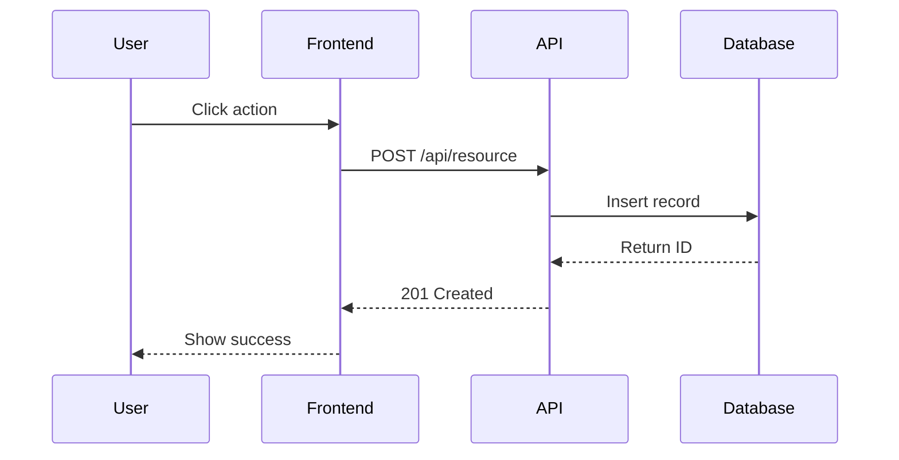
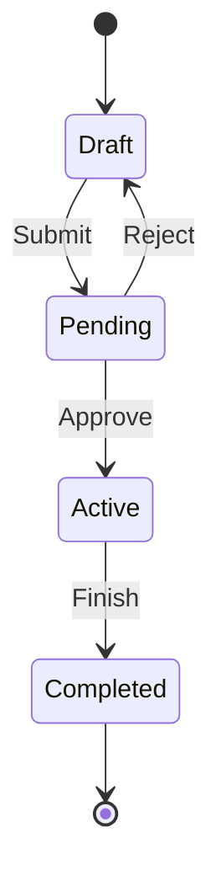
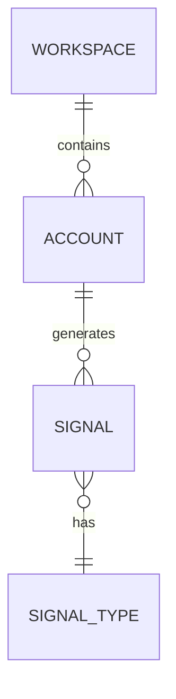

# /prepare-epic - Prepare Epic for Implementation

Use this skill to take a Plane epic and prepare it for implementation. This workflow refines requirements through iterative clarification, creates detailed subtasks with dependencies, writes comprehensive test cases, and enriches everything with API exploration and documentation links.

**Key Differentiator**: Unlike `/implement-epic` (which writes code), this skill produces only **plain English specifications** ready for implementation.

## Usage

```
/prepare-epic <EPIC-ID>
```

Example: `/prepare-epic BETON-42` or `/prepare-epic INSP-15`

---

## Understanding Epics in Plane

Epics are a **distinct entity type** in Plane, separate from regular work items. This has important implications when using MCP tools:

- **Separate API**: Epics use `/workspaces/{slug}/projects/{id}/epics/`, not the work items endpoint
- **`is_epic` flag**: Work item types have an `is_epic: boolean` field — types with `is_epic: true` are epic types
- **No dedicated MCP tools**: The Plane MCP server exposes NO epic-specific tools (no `list_epics`, `retrieve_epic`, etc.)
- **Shared identifier scheme**: Epics share the same identifier format (e.g., `BETON-42`), so `retrieve_work_item_by_identifier` works for fetching them
- **Parent-child via `parent` field**: Work items belong to an epic by setting their `parent` field to the epic's UUID. Each work item can belong to at most one epic.
- **Project setting**: Epics must be enabled per-project in Plane settings
- **Convertible**: Epics can be converted to/from work items in the Plane UI

### Working with Epics via MCP Tools

Since there are no dedicated epic MCP tools, use these workarounds:

| Action | MCP Tool to Use | Notes |
|--------|----------------|-------|
| Fetch an epic | `retrieve_work_item_by_identifier` | Works because epics share the identifier scheme |
| Update an epic | `update_work_item` | Works for updating description, status, etc. |
| List epic subtasks | `list_work_items` with `parent_id` | Pass the epic's UUID as `parent_id` |
| Verify epic type | `list_work_item_types` | Look for types where `is_epic: true` |

### Recommended First Step

Before fetching the epic, call `list_work_item_types` to identify the epic type ID in the project. This confirms epics are enabled and gives you the type ID for reference:

```
mcp__plane__list_work_item_types:
  - project_id: <project uuid>
```

Look for a type with `is_epic: true` in the response. If none exists, epics may not be enabled for this project.

---

## Workflow

### Phase 1: Epic Discovery

#### Step 1.1: Fetch the Epic

Use the Plane MCP tools to read the epic:

```
mcp__plane__retrieve_work_item_by_identifier:
  - project_identifier: <PROJECT> (e.g., "BETON", "INSP")
  - sequence_id: <NUMBER> (e.g., "42")
```

Read and note:
- Epic title and description
- Acceptance criteria (if any)
- Any attachments or linked resources

> **Note:** Epics are a separate entity type in Plane, but `retrieve_work_item_by_identifier` works for them because they share the identifier scheme. If this call returns unexpected results, see the [Understanding Epics in Plane](#understanding-epics-in-plane) section for troubleshooting.

#### Step 1.2: Identify Linked Resources

Check the epic description for:
- Figma design links
- External API documentation URLs
- Third-party service docs
- Internal wiki references

Use `WebFetch` to read linked resources and extract requirements.

#### Step 1.3: List Existing Subtasks

If the epic already has subtasks or relations:

```
mcp__plane__list_work_items:
  - project_id: <uuid from epic>
  - parent_id: <epic uuid>
```

Or:

```
mcp__plane__list_work_item_relations:
  - project_id: <uuid from epic>
  - work_item_id: <epic uuid>
```

Note any existing structure to build upon.

---

### Phase 2: Requirements Clarification (Iterative)

This is the most critical phase. Requirements often have ambiguities, gaps, and undefined behaviors.

#### Step 2.1: Analyze Requirements

Review the epic description and identify:

**Ambiguities:**
- Terms that could be interpreted multiple ways
- Missing definitions or examples
- Unclear scope boundaries

**Gaps:**
- Edge cases not addressed
- Error scenarios not specified
- Integration points not detailed
- Performance requirements missing

**Undefined Behaviors:**
- What happens when data is missing?
- How should errors be handled?
- What are the fallback behaviors?
- What are the security considerations?

#### Step 2.2: Ask Clarifying Questions

Use `AskUserQuestion` to clarify requirements. Group questions by topic:

**Edge Cases & Error Handling:**
- What happens when [X] is empty/null?
- How should the system respond to [error condition]?
- What's the expected behavior when [boundary condition]?

**Integration Specifics:**
- Which API endpoint(s) should be used?
- What authentication method is required?
- What are the rate limits to respect?

**UX Decisions:**
- What feedback should users see during [action]?
- How should loading states be displayed?
- What happens after [action] succeeds/fails?

**Priority & Scope:**
- Is [feature X] in scope for this epic?
- What's the priority order of these sub-features?
- Are there any hard deadlines or constraints?

#### Step 2.3: Iterate Until Clear

Repeat Step 2.2 until:
- All acceptance criteria are specific and testable
- Edge cases have defined behaviors
- Integration points are fully specified
- No remaining ambiguities

#### Step 2.4: Document Decisions

Keep a record of all decisions made during clarification:

```
## Decisions Made

1. **Empty state handling**: Show "No items yet" message with CTA
2. **Rate limiting**: Implement exponential backoff with 3 retries
3. **Error display**: Toast notification for transient errors, inline for validation
...
```

---

### Phase 3: Epic Refinement

#### Step 3.1: Update Epic Description

Enhance the epic description with:

1. **Clarified Requirements**: Rewrite requirements in precise language
2. **Acceptance Criteria**: Explicit, testable criteria in checkbox format
3. **Technical Constraints**: Any technical decisions or constraints identified
4. **Out-of-Scope Items**: Explicitly list what is NOT included

#### Step 3.2: Save to Plane

> **Note:** `update_work_item` works for epics despite them being a separate entity type in Plane. The MCP tool handles them transparently.

Use `mcp__plane__update_work_item` to update the epic:

```
mcp__plane__update_work_item:
  - project_id: <project uuid>
  - work_item_id: <epic uuid>
  - description_html: <updated HTML description>
```

**Example Updated Description (HTML):**

```html
<h2>Overview</h2>
<p>[Refined description of what the epic accomplishes]</p>

<h2>Acceptance Criteria</h2>
<ul>
  <li>[ ] Criterion 1 (specific, testable)</li>
  <li>[ ] Criterion 2</li>
  <li>[ ] Criterion 3</li>
</ul>

<h2>Technical Constraints</h2>
<ul>
  <li>Must use existing Supabase client pattern</li>
  <li>API must support pagination</li>
</ul>

<h2>Out of Scope</h2>
<ul>
  <li>Bulk operations (future epic)</li>
  <li>Export functionality (future epic)</li>
</ul>

<h2>Decisions Made</h2>
<ul>
  <li><strong>Empty state:</strong> Show "No items yet" with CTA</li>
  <li><strong>Error handling:</strong> Toast for API errors, inline for validation</li>
</ul>
```

---

### Phase 4: Task Breakdown

#### Step 4.1: Decompose Into Implementable Tasks

Break the epic into tasks that:
- Can be completed in 1-4 hours
- Have clear boundaries
- Have minimal overlap with other tasks
- Follow a logical dependency order

**Typical task categories:**
1. Database migrations (if needed)
2. API endpoints (backend logic)
3. Frontend components/pages
4. Integration wiring
5. Error handling & edge cases
6. Polish & UX improvements

#### Step 4.2: Create Subtasks

For each task, use `mcp__plane__create_work_item` with structured description:

```
mcp__plane__create_work_item:
  - project_id: <project uuid>
  - name: <task title>
  - description_html: <structured description - see template below>
  - type: <task type id>
  - parent: <epic uuid>  # Links this work item as a child of the epic
```

**IMPORTANT:** Set `parent` to the epic's UUID to establish the parent-child relationship. This is how work items are associated with epics in Plane.

> **Epic parent constraint:** Each work item can belong to at most one epic via the `parent` field. The parent must be a work item type where `is_epic: true`. If the epic type is not found, verify epics are enabled in the project settings and run `list_work_item_types` to confirm.

#### Step 4.3: Create Task Relations

For tasks with dependencies, create relations:

```
mcp__plane__create_work_item_relation:
  - project_id: <project uuid>
  - work_item_id: <source task uuid>
  - related_work_item_id: <target task uuid>
  - relation_type: "blocking"  # or "blocked_by", "relates_to"
```

**Relation types:**
- `blocking`: This task blocks the target task
- `blocked_by`: This task is blocked by the target task
- `relates_to`: Tasks are related but not dependent

---

### Phase 5: Test Planning

#### Step 5.1: Identify Test Areas

For each feature area in the epic, identify:
- Happy path scenarios
- Error/failure scenarios
- Edge cases
- Security considerations
- Performance concerns

#### Step 5.2: Create Test Tasks

Create **separate test tasks** for each major feature area:

```
mcp__plane__create_work_item:
  - project_id: <project uuid>
  - name: "Test: <feature name>"
  - description_html: <test cases - see template below>
  - type: <task type id>
  - parent: <epic uuid>
```

#### Step 5.3: Link Test Tasks

Link test tasks to their implementation tasks:

```
mcp__plane__create_work_item_relation:
  - project_id: <project uuid>
  - work_item_id: <test task uuid>
  - related_work_item_id: <implementation task uuid>
  - relation_type: "relates_to"
```

---

### Phase 6: Documentation & Diagrams

#### Step 6.1: Add Mermaid Diagrams

Where helpful, add Mermaid diagrams to task descriptions:

**Sequence Diagram (API Flow):**
```

```

**State Diagram (Workflow):**
```

```

**ER Diagram (Data Model):**
```

```

#### Step 6.2: Attach Documentation Links

For each relevant task, attach documentation:

```
mcp__plane__create_work_item_link:
  - project_id: <project uuid>
  - work_item_id: <task uuid>
  - url: <documentation URL>
  - title: <link title>
```

**Common link types:**
- Plane wiki pages
- GitHub repos
- Third-party API docs (PostHog, Stripe, etc.)
- Design files (Figma)
- Internal architecture docs

---

### Phase 7: API Exploration

If the epic involves third-party APIs:

#### Step 7.1: Identify APIs Involved

List all external APIs the epic requires:
- PostHog
- Stripe
- Apollo
- Attio
- Other third-party services

#### Step 7.2: Request Credentials (If Needed)

Use `AskUserQuestion` to request:
- API keys (for testing)
- Environment details (staging vs production)
- Rate limit information
- Special access requirements

**Never hardcode credentials** - request them interactively.

#### Step 7.3: Test APIs

Use curl to understand API behavior:

```bash
# Example: Test an API endpoint
curl -s -H "Authorization: Bearer $API_KEY" \
  "https://api.example.com/v1/resource" | jq
```

Document:
- Request format (headers, body)
- Response structure (fields, types)
- Error responses (status codes, error format)
- Rate limits (headers, quotas)

#### Step 7.4: Update Task Descriptions

Add concrete API examples to relevant subtask descriptions:

```html
<h3>API Reference</h3>
<p><strong>Request:</strong></p>
<pre><code>
POST https://api.posthog.com/api/projects/{project_id}/events
Headers: Authorization: Bearer {api_key}
Body: { "event": "page_view", "distinct_id": "user_123" }
</code></pre>

<p><strong>Response:</strong></p>
<pre><code>
{
  "status": 1,
  "queued": true
}
</code></pre>

<p><strong>Error Response (401):</strong></p>
<pre><code>
{ "detail": "Authentication credentials were not provided." }
</code></pre>
```

---

## Task Description Template

Use this HTML structure for all subtasks:

```html
<h2>Overview</h2>
<p>[1-2 sentences describing what this task accomplishes]</p>

<h2>Acceptance Criteria</h2>
<ul>
  <li>[ ] Criterion 1 (specific, testable)</li>
  <li>[ ] Criterion 2</li>
  <li>[ ] Criterion 3</li>
</ul>

<h2>Implementation Hints</h2>
<p><strong>Files likely involved:</strong></p>
<ul>
  <li><code>src/app/api/...</code> - for API routes</li>
  <li><code>src/lib/...</code> - for business logic</li>
</ul>
<p><strong>Patterns to follow:</strong></p>
<ul>
  <li>[Reference existing similar code]</li>
  <li>[Note any architectural decisions]</li>
</ul>

<h2>Edge Cases</h2>
<ul>
  <li>What happens when X is empty/null?</li>
  <li>What happens when API returns error?</li>
  <li>What about rate limiting?</li>
</ul>

<h2>Dependencies</h2>
<p>Blocked by: [TASK-IDs or "None"]</p>
<p>Blocks: [TASK-IDs or "None"]</p>
```

---

## Test Task Template

Use this HTML structure for test tasks:

```html
<h2>Test: [Feature Name]</h2>

<h3>Test Case 1: [Scenario Name]</h3>
<p><strong>Preconditions:</strong></p>
<ul>
  <li>User is authenticated</li>
  <li>Workspace exists with sample data</li>
</ul>

<p><strong>Steps:</strong></p>
<ol>
  <li><strong>Given</strong> [initial state]</li>
  <li><strong>When</strong> [action taken]</li>
  <li><strong>Then</strong> [expected result]</li>
</ol>

<p><strong>Expected Result:</strong></p>
<ul>
  <li>Response status: 200</li>
  <li>Data contains: [specific fields]</li>
</ul>

<h3>Test Case 2: Error Handling</h3>
<p><strong>Given</strong> [error condition]</p>
<p><strong>When</strong> [action]</p>
<p><strong>Then</strong> [error response expected]</p>

<h3>Edge Cases to Verify</h3>
<ul>
  <li>[ ] Empty input</li>
  <li>[ ] Invalid ID format</li>
  <li>[ ] Unauthorized access</li>
  <li>[ ] Rate limit exceeded</li>
</ul>
```

---

## Plane MCP Tools Reference

| Tool | Purpose |
|------|---------|
| `mcp__plane__retrieve_work_item_by_identifier` | Fetch epic by ID (e.g., BETON-42) |
| `mcp__plane__update_work_item` | Update epic description |
| `mcp__plane__create_work_item` | Create subtasks (set `parent` to epic ID) |
| `mcp__plane__create_work_item_relation` | Link tasks: `blocking`, `blocked_by`, `relates_to` |
| `mcp__plane__create_work_item_link` | Attach documentation URLs |
| `mcp__plane__create_work_item_comment` | Add notes/decisions to items |
| `mcp__plane__list_work_items` | List items in a project (use `parent_id` to filter by epic) |
| `mcp__plane__list_work_item_relations` | List relations for an item |
| `mcp__plane__list_work_item_types` | List work item types; identify epic types via `is_epic: true` flag |

---

## Checklist

- [ ] **Phase 1: Discovery**
  - [ ] Fetched epic from Plane
  - [ ] Identified linked resources (Figma, docs, APIs)
  - [ ] Listed existing subtasks/relations

- [ ] **Phase 2: Clarification**
  - [ ] Analyzed requirements for ambiguities/gaps
  - [ ] Asked clarifying questions via `AskUserQuestion`
  - [ ] Documented all decisions made

- [ ] **Phase 3: Refinement**
  - [ ] Updated epic description with clarified requirements
  - [ ] Added explicit acceptance criteria
  - [ ] Listed out-of-scope items
  - [ ] Saved to Plane

- [ ] **Phase 4: Task Breakdown**
  - [ ] Decomposed into implementable subtasks
  - [ ] Created each subtask with structured template
  - [ ] Set `parent` to epic ID for all subtasks
  - [ ] Created relations between dependent tasks

- [ ] **Phase 5: Test Planning**
  - [ ] Created separate test tasks for each feature area
  - [ ] Wrote detailed test cases (Given/When/Then)
  - [ ] Linked test tasks to implementation tasks

- [ ] **Phase 6: Documentation**
  - [ ] Added Mermaid diagrams where helpful
  - [ ] Attached documentation links

- [ ] **Phase 7: API Exploration**
  - [ ] Identified third-party APIs involved
  - [ ] Tested APIs with curl
  - [ ] Documented request/response formats
  - [ ] Updated task descriptions with API examples

- [ ] **All content is plain English (no code implementations)**

---

## Example Output

After running `/prepare-epic BETON-42`, the epic might have:

**Updated Epic Description:**
- Clarified requirements
- 5 acceptance criteria
- Technical constraints listed
- Out-of-scope items noted
- Decisions documented

**Subtasks Created:**
1. `BETON-43`: Add database migration for new table
   - Detailed schema description
   - RLS policy requirements
   - Blocked by: None / Blocks: BETON-44

2. `BETON-44`: Create API endpoint for resource
   - Request/response formats
   - Error handling specs
   - Blocked by: BETON-43 / Blocks: BETON-45

3. `BETON-45`: Build frontend form component
   - Field requirements
   - Validation rules
   - Blocked by: BETON-44

4. `BETON-46`: Test: Resource CRUD operations
   - 5 test cases
   - Edge cases checklist
   - Relates to: BETON-44, BETON-45

**Links Attached:**
- PostHog API docs
- Figma design file
- Related internal wiki page

---

## Troubleshooting

| Issue | Solution |
|-------|----------|
| Epic not found | Verify project identifier and sequence ID |
| MCP tool fails | Check Plane connection with `/mcp status` |
| Can't create subtask | Ensure `parent` is set to epic's UUID |
| Relation not created | Verify both work item UUIDs exist |
| User not responding to questions | Simplify questions, provide context |
| Epic type not found | Run `list_work_item_types` and look for `is_epic: true`; verify epics are enabled in project settings |

---

## Notes

- **This skill complements `/implement-epic`** - use `prepare-epic` first, then `implement-epic`
- **All output is plain English** - no code implementations in epic or subtasks
- **Mermaid diagrams go in task descriptions** - Plane renders them
- **API exploration uses curl** - not code implementations
- **Credentials are requested via `AskUserQuestion`** - never hardcoded
- **Test tasks are separate work items** - linked via `relates_to` relation
- **Be thorough in clarification** - unclear requirements lead to rework
- **Document decisions** - future developers need context
